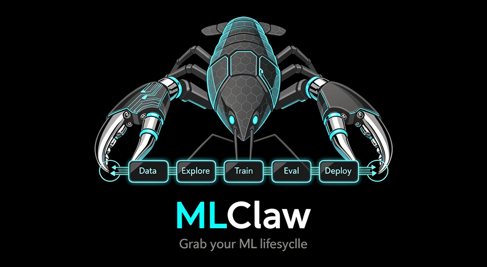

<p align="center">
  
</p>

<h3 align="center">OpenClaw for ML Engineers</h3>

<p align="center">
  Talk to your ML pipeline. No SDK. No YAML. No code changes.
</p>

---

## The Problem

You got a training repo from GitHub. Now what?

```
1. Read the code to figure out how to run it               (30 min)
2. Install dependencies, fix version conflicts             (1 hour)
3. Find where to put your data, wrong format               (1 hour)
4. SSH keys here, AWS creds there, data somewhere else
   — where is everything?                                  (30 min)
5. Run training, find the checkpoint, wrong path           (30 min)
6. Run eval, output format doesn't match                   (30 min)
7. Convert to ONNX for deployment, accuracy drops          (1 hour)
8. Write a report for your boss                            (30 min)
9. Which run was the good one?
   exp1/ exp_final/ exp_final_v2/ exp_final_v2_fixed/
   exp_DONT_DELETE/ exp_best_maybe/
   ... mass-delete them all 3 months later                 (∞)
```

**6 hours of plumbing. 0 hours of actual ML work.**

MLflow records step 5-6. The other 80%? You're on your own.

## The Solution

```
You:     "Here's a repo from GitHub. I have data at D:\dataset.
          Train it, eval it, deploy to Jetson."

MLClaw:   Clones repo → reads code → installs deps → converts your data
          to match the code's format → trains → evals → converts to
          TensorRT → benchmarks on Jetson → generates report. Done.
```
```
You:     "Which of my last 5 runs was best? What was different?"

MLClaw:   Run 3 had the best accuracy (92.3%), lr=0.001 with cosine schedule.
          Run 5 tried higher lr — accuracy dropped 1.5%. Run 2 used a smaller
          model — faster but 2% less accurate.

You:     "Show me a chart."

MLClaw:   [generates an interactive HTML comparison report and opens browser]
```
```
You:     "Accuracy dropped 3% since last week. What changed?"

MLClaw:   Comparing run_0312 (92.3%) vs run_0316 (89.1%). You updated numpy
          1.26→2.0, changed batch_size 32→64, and added augmentation.
          Most likely cause: numpy update — run_0314 had the same augmentation
          but kept numpy 1.26 and scored 91.8%. Want to roll back and re-run?
```
```
You:     "How's that training I started yesterday?"

MLClaw:   Running on server-2, epoch 47/100, loss 0.23 (still decreasing).
          ETA ~3 hours. No errors. GPU memory 78%.
```

**MLflow manages the boxes. MLClaw manages the arrows between them.**

## Why It Won't Break Your Stuff

```
┌──────┐  config.json  ┌─────────┐  config.json  ┌───────┐  config.json  ┌──────┐  config.json  ┌───────┐  config.json  ┌────────┐
│ Data │ ───────────→  │ Explore │ ───────────→  │ Train │ ───────────→  │ Eval │ ───────────→  │ Infer │ ───────────→  │Deploy  │
└──────┘  auto-convert └─────────┘  best config  └───────┘  checkpoint   └──────┘  metrics      └───────┘  model        └────────┘
          data format   overnight    locked in     + env     + bad cases   + report  converted     + report
          to match      experiment                 snapshot                          + benchmarked
          target code   loop
```

Every arrow is a **fixed-schema JSON contract** — agent fills values, can't change structure. Your code stays untouched, nothing changes until you confirm, and every run is a frozen snapshot you can always go back to.

## Quick Start

```bash
npm install -g @anthropic-ai/claude-code
git clone https://github.com/user/mlclaw.git && cd mlclaw
claude
# "Create a new project for vehicle detection"
# "I have inference code at https://github.com/xxx, set it up"
```

## Status

- [x] Inference (init + run)
- [x] Project Init + Resource Discovery
- [ ] Training / Evaluation / Exploration
- [ ] Data (auto-format conversion)
- [ ] Deployment (edge + cloud)

## License

MIT
