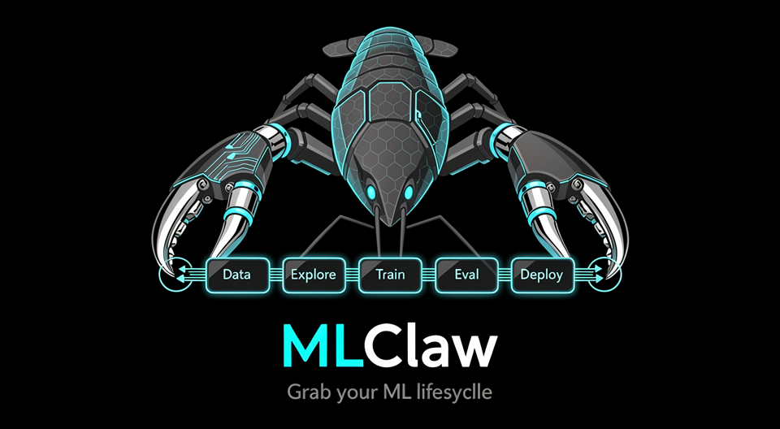

<p align="center">
  
</p>

<h3 align="center">OpenClaw for ML Engineers</h3>

<p align="center">
  Talk to your ML pipeline. No SDK. No YAML. No code changes.
</p>

---

## The Problem

You got a training repo from GitHub. Now what?

```
1. Read the code to figure out how to run it               (30 min)
2. Install dependencies, fix version conflicts             (1 hour)
3. Find where to put your data, wrong format               (1 hour)
4. SSH keys here, AWS creds there, data somewhere else
   — where is everything?                                  (30 min)
5. Run training, find the checkpoint, wrong path           (30 min)
6. Run eval, output format doesn't match                   (30 min)
7. Convert to ONNX for deployment, accuracy drops          (1 hour)
8. Write a report for your boss                            (30 min)
9. Which run was the good one?
   exp1/ exp_final/ exp_final_v2/ exp_final_v2_fixed/
   exp_DONT_DELETE/ exp_best_maybe/
   ... mass-delete them all 3 months later                 (∞)
```

**6 hours of plumbing. 0 hours of actual ML work.**

Then you start tuning, and the second problem shows up. Three weeks later nobody
remembers why lr=3e-4 got abandoned. All 40 runs are still on disk. The reasoning isn't —
it was never written anywhere.

## The Solution

```
You:     "Here's a repo from GitHub. I have data at D:\dataset.
          Train it, eval it, deploy to Jetson."

MLClaw:   Clones repo → reads code → installs deps → converts your data
          to match the code's format → trains → evals → converts to
          TensorRT → benchmarks on Jetson → generates report. Done.
```
```
You:     "Which of my last 5 runs was best? What was different?"

MLClaw:   Run 3 had the best accuracy (92.3%), lr=0.001 with cosine schedule.
          Run 5 tried higher lr — accuracy dropped 1.5%. Run 2 used a smaller
          model — faster but 2% less accurate.

You:     "Show me a chart."

MLClaw:   [generates an interactive HTML comparison report and opens browser]
```
```
You:     "Accuracy dropped 3% since last week. What changed?"

MLClaw:   Comparing run_0312 (92.3%) vs run_0316 (89.1%). You updated numpy
          1.26→2.0, changed batch_size 32→64, and added augmentation.
          Most likely cause: numpy update — run_0314 had the same augmentation
          but kept numpy 1.26 and scored 91.8%. Want to roll back and re-run?
```
```
You:     "How's that training I started yesterday?"

MLClaw:   Running on server-2, epoch 47/100, loss 0.23 (still decreasing).
          ETA ~3 hours. No errors. GPU memory 78%.
```

*Working today: the clone → train → tune → eval → report path. Not yet: data conversion,
cross-run diffing, deployment — see [Status](#status).*

## What a Tracker Can't Record

```
You:     "Tune lr for this model. 20 trials, then tell me what you learned."

MLClaw:   [iter 0] [baseline]    lr=1e-4                        → val_acc 0.965
          [iter 1] [fill_grid]   "2e-4 should be better"        → 0.963, refuted
          [iter 2] [fill_grid]   "try the other direction, 5e-5"→ 0.968, confirmed
          ...
          [iter 8] [add_axis]    "lr is covered, introduce warmup" → 0.971
          Stopping: best stable 4 iters, no gaps left.
          Wrote chain.md — best 0.972 @ lr=2.5e-4 + warmup=0.03, 18 trials.
```

`/train-tune` is an agent-driven search loop, not a grid. Each iteration it re-reads every
comparable prior run, asks *where is the evidence weakest*, and tags the decision it makes:
`fill_grid` (an axis has a gap) · `refine_best` (densify around the leader) · `add_axis`
(current axes are covered) · `verify` (re-run for noise). Each trial gets a **hypothesis**
written before it launches and an **outcome** written after.

`/train-tune-report` then renders the session as a `chain.md` — headline, best-so-far
sequence, per-axis coverage map, the full decision timeline, and the part that matters
three weeks later:

```
## Confirmed
- lr range [2e-4, 3e-4] is the sweet spot; internal differences < 0.1%.
- warmup_ratio=0.03 beats 0 (weak signal).

## Refuted
- lr ≥ 5e-3: numerically unstable; loss diverges around epoch 30.
- weight_decay = 1e-2: val_acc drops 2%.

## Open questions
- **Single-seed result** — best config has not been verified across multiple seeds.
```

A tracker records that run 17 won. It cannot tell you that lr above 3e-4 was ruled out on
iteration 4 and why — that sentence was never produced, because nothing in a sweep is
asked to produce it. This is the one axis where MLClaw is doing something a tracker
structurally can't.

**And it will tell you when the search was worthless.** If every trial comes back with the
exact same metric, the session refuses to name a winner: status `no_signal`, no recipe, and
a diagnosis pointing at the likeliest cause — a swept flag that never reached the code.

## When Someone Else Has Your Data

```
You:     "These 5000 images need labeling. Send them out."

MLClaw:   Frozen: 5000 items, sha256 each, spec v3 snapshotted, due 8/14, to vendor-a.
          Manifest is the record — you move the bytes however you like.

          ... 11 days later, new session, nothing else asked ...

MLClaw:   One handoff is out: 5000 images to vendor-a, 11 days, due in 3.

          ... they say it's done ...

You:      "They say it's done. Pull it back."

MLClaw:   sent 5000 · matched 4712 · missing 288 · unexpected 3 · coverage 0.9424
          And 12 source images changed since you sent them — those labels point at
          bytes that aren't on disk anymore.
          Not accepted. Reject and rework the 288, or accept at 0.9424 explicitly?
```

"It's done" is a claim, not evidence. Every other MLClaw skill closes its own loop — it starts the
process, watches it, reads the result. This is the one where somebody else closes it, so the
manifest frozen at send time is the only authority there is; nothing can go ask the vendor what
they actually did. Accepting is a separate step from reconciling, and accepting a partial batch
means typing the coverage you're accepting.

The reason it matters three months later: the accepted batch becomes `lineage.parents` on every
run that trains on it, carrying its spec version and its 0.9424. Without that, *"why did the
model get worse after we added the new data"* has no answer — with it, it's a DAG walk.

**Where MLClaw is not the tool**: there is no live dashboard, nothing streams to a browser,
and runs are a directory tree on your disk sized for one user and ≲10k runs per project.
If you want a real-time UI or team-scale run storage, keep W&B or TensorBoard — MLClaw
reads what your code already writes and doesn't care what else is watching.

## Why It Won't Break Your Stuff

```
┌──────┐  config.json  ┌─────────┐  config.json  ┌───────┐  config.json  ┌──────┐  config.json  ┌───────┐  config.json  ┌────────┐
│ Data │ ───────────→  │ Explore │ ───────────→  │ Train │ ───────────→  │ Eval │ ───────────→  │ Infer │ ───────────→  │Deploy  │
└──────┘  auto-convert └─────────┘  best config  └───────┘  checkpoint   └──────┘  metrics      └───────┘  model        └────────┘
          data format   overnight    locked in     + env     + bad cases   + report  converted     + report
          to match      experiment                 snapshot                          + benchmarked
          target code   loop
```

Every arrow is a **fixed-schema JSON contract** — agent fills values, can't change structure. Your code stays untouched, nothing changes until you confirm, and every run is a frozen snapshot you can always go back to.

**Zero code invasion.** You are never asked to add a logging call, a decorator, or an SDK
import. Metrics are read from the jsonl or stdout your training loop already emits; code
version (git SHA plus a diff of the dirty tree), environment, and effective params are
captured from outside the process.

**Params are checked before they're trusted.** `/train-init` records, per param, whether it
can actually be overridden from outside — a `--lr` flag is dead if the optimizer is built
with a literal, and a run that silently ignores your value reports a number produced by a
different one. Params it can't reach are marked unsearchable and excluded from tuning
instead of being swept for nothing.

One stage sits off that line: **refactor**. Point it at a research repo and each round cuts
dead code, re-runs the paper's benchmark, and commits or reverts on whether the number
still reproduces.

## Quick Start

```bash
npm install -g @anthropic-ai/claude-code
git clone https://github.com/Ryanshuai/MLClaw.git && cd MLClaw
claude
# "Create a new project for vehicle detection"
# "I have inference code at https://github.com/xxx, set it up"
```

## Status

- [x] Project init + resource discovery — `/project-init`, `/resources`
- [x] Inference — `/infer-init`, `/infer-run`
- [x] Evaluation — `/eval-init`, `/eval-run`, `/eval-report`
- [x] Training — `/train-init`, `/train-run` (background launch, stream monitoring, crash diagnosis, best-checkpoint selection + retention)
- [x] Adaptive HPO — `/train-tune`, `/train-tune-report` (hypothesis/outcome per trial, chain.md)
- [x] Refactor — `/refactor-init`, `/refactor-run`, `/refactor-report`
- [x] External handoff — `/data-label` (frozen manifest, spec snapshot, coverage + drift reconciliation on return)
- [x] Human exchange — `/ask-human` (a question to a person, answered as claim / verified / decision; refuses `verified` when nothing checked it)
- [x] Data archaeology — `/data-discover` (inherit a project and find out what data exists: sweep code, git history, tracking, S3, docs, people; `gone` and `unreachable` are never the same answer). Called by the `-init` skills
- [x] Data ingest — `/data-collect` (pull from a named resource, record what arrived; optional rig-provenance stamp with tripwires on hardware that changes silently)
- [x] Data census — `/data-check` (where every unit is across machines, what layers it carries, what claims it finished; citable snapshots for lineage, resolved into openable paths for the training side)
- [x] Data freeze — `/data-freeze` (pin membership as `datasets/<id>@<snapshot>`, the citation the model lifecycle records; refuses a partial census, unverified-complete units, a reused id)
- [x] Data curate — `/data-curate` (derive a dataset and record what it was made of, checked against the run's own lineage; refuses an output root inside its own input)
- [x] Data retire — `/data-retire` (rank by what survives the deletion, exclude cited/unreplicated/unarchived units, `plan → apply`, and a log that outlives what it deleted)
- [x] Data lifecycle routing — `/data` (phase across Collect/Label/Curate/Freeze, snapshot staleness against accepted inflow, transition gates)
- [x] Data board — `/data-report` (every dataset on the line in one self-contained HTML page)
- [x] Reproduction — `/repro` (five axes of rot audited per run; a noise band measured on the pipeline instead of a guessed tolerance; a frozen probe set through both artifacts, because two runs can share a metric and not a prediction; one axis pinned per iteration until the divergence is attributed)
- [x] Bad-case triage — `/eval-triage` (rank an eval's worst per-sample scores, judge each one, route to whoever owns it: wrong label / hard sample / model problem — three piles, because routing them as one makes two worse)
- [x] Online sampling — `/data-online-sample` (a dated, uniform reading of the live input stream, so what production sees can be compared against the snapshot a model trained on. Records the denominator when something can count it and says every rate is a lower bound when nothing can)
- [x] Skill dependency system (inter-skill graph + internal dependency chain + cross-session resume)
- [x] Remote execution + path mapping
- [ ] Run comparison — `/train-compare` (side-by-side metrics/params/env diff)
- [ ] Drift — `/data-drift`. Only the comparison is missing; the online half that takes the reading already shipped (see the checked entry above)
- [ ] Model identity — `models/<id>@<release>`, the primitive the next two need. Not a skill: data gets a citable frozen id and a deletion that respects citations, models get a file path and a `retention.py` that ranks by metric and does not know who cited them
- [ ] Deployment (edge + cloud) — `/deploy-init` + `/deploy-run`. "Better", "approved" and "serving" are three records, and conflating the first with the last is how a leaderboard's winner is believed to be live while something else is
- [ ] Model curate — export/quantization as a recorded derivation, whose one refusal is that an exported model never inherits the source model's metrics
- [ ] Exploration (architecture search)
- [ ] Data quality checks + auto-format conversion — the curate stage *records* a conversion and the census reads no file content; neither performs one

## License

MIT
